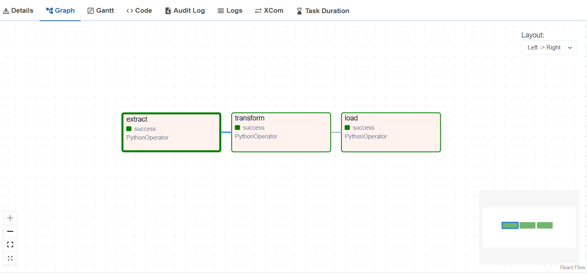
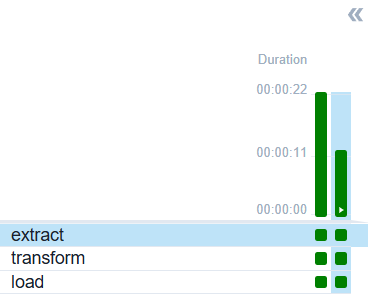
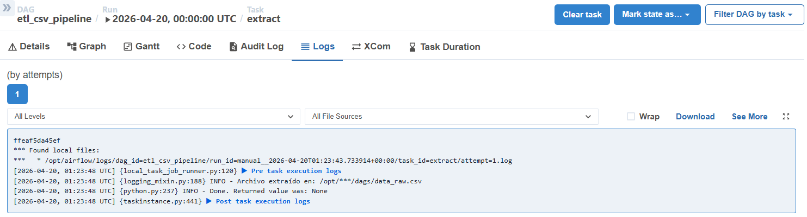

# 🚀 Airflow ETL Pipeline (Docker + WSL)

Proyecto de **Ingeniería de Datos** donde se implementa un entorno de orquestación utilizando **Apache Airflow** con **Docker**, desarrollando un pipeline ETL funcional y resolviendo problemas reales de configuración.

---

## 📌 Descripción

Este proyecto consiste en la implementación de un pipeline ETL orquestado con Apache Airflow, ejecutado en un entorno local basado en Docker y WSL.

El objetivo es simular un flujo de datos real donde se extraen, transforman y cargan datos, entendiendo cómo Airflow gestiona dependencias, ejecución y monitoreo de tareas.

---

## 🧠 Aprendizajes clave

Durante el desarrollo se abordaron problemas reales de entornos productivos:

- Configuración de Airflow con PostgreSQL en Docker  
- Integración de Docker con WSL  
- Manejo de errores de permisos en volúmenes (`logs/`)  
- Inicialización correcta de la base de datos de Airflow  
- Debugging de contenedores y servicios  

---

## ⚙️ Tecnologías utilizadas

- Apache Airflow 2.9.1  
- Docker & Docker Compose  
- Python  
- PostgreSQL  
- WSL (Windows Subsystem for Linux)  

---

## 🔄 Pipeline ETL

El DAG implementado sigue la estructura clásica:

1. **Extract**  
   Generación de datos simulados en formato CSV  

2. **Transform**  
   Limpieza y filtrado de datos (ejemplo: edad > 24)  

3. **Load**  
   Generación de dataset final listo para consumo  

### 🔹 Resultado del pipeline
El pipeline genera archivos CSV procesados con datos filtrados listos para análisis.

---

## 📂 Estructura del proyecto

airflow-docker/
│
├── dags/
│ └── etl_csv_pipeline.py
│
├── docker-compose.yml
├── README.md
└── .gitignore
---

## ▶️ Ejecución del proyecto

1. Levantar servicios:

```bash
docker compose up -d```

2. Acceder a Airflow:

http://localhost:8080

3. Actiar y ejecutar el DAG:
- etl_csv_pipeline
- Trigger DAG desde la interfaz

## 📊 Evidencia

### 🔹 Graph View del DAG


### 🔹 Ejecuciones del DAG


### 🔹 Logs de ejecución


## 🚨 Retos enfrentados
- Problemas de permisos en volúmenes Docker (Permission denied logs)
- Inicialización incorrecta de la base de datos
- Dependencias entre servicios (PostgreSQL y Airflow)
- Debugging de errores en contenedores

## 🚀 Próximos pasos
- Integración con APIs reales
- Orquestación de jobs de Spark
- Implementación en la nube (AWS / GCP)
- Integración con Data Lakes / Databricks

## 👨‍💻 Autor
Oracio Tamayo Alejo
Apasionado por la Ingeniería de Datos, enfocado en el desarrollo de pipelines, procesamiento de datos y arquitectura Big Data.

### 📌 Nota
Este proyecto forma parte de mi proceso de aprendizaje en Data Engineering, aplicando buenas prácticas y simulando escenarios reales de la industria.
